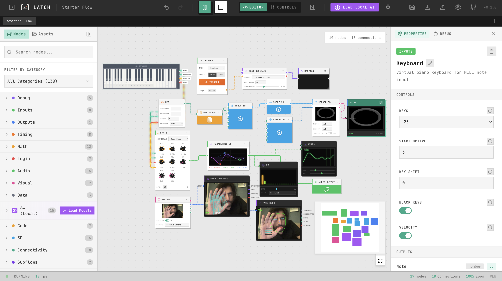
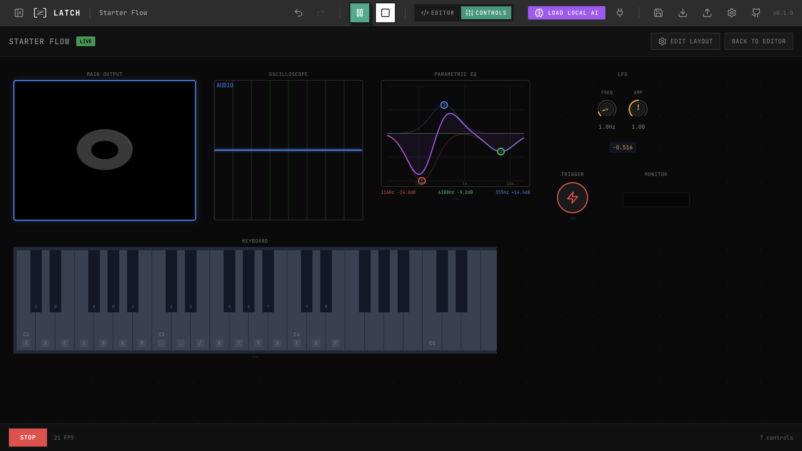
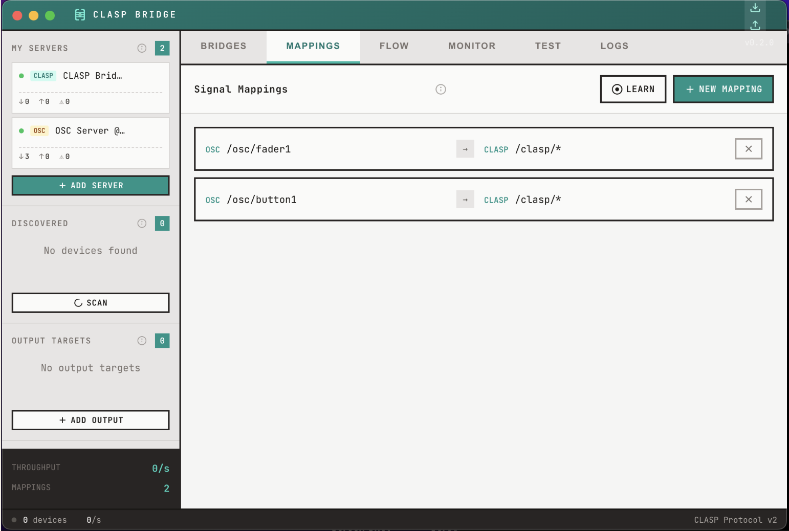

<p align="center">
  
</p>

<h1 align="center">LATCH</h1>

<p align="center">
  <strong>Live Art Tool for Creative Humans</strong>
</p>

<p align="center">
  LATCH is an open-source visual flow/node programming environment that combines the best of TouchDesigner, PureData, Max/MSP, and Node-RED. Build complex audio-visual pipelines, 3D scenes, IoT integrations, AI workflows, and interactive experiences through an intuitive node-based interface.
</p>

<p align="center">
  Built with Vue 3 + TypeScript. Runs in the browser and as a desktop app (Electron).
</p>

<p align="center">
  <em>Status: Phase 9 Complete + Stability Polish | MiniMap with node colors | AI Model Manager | Debug Nodes</em>
</p>

<p align="center">
  <a href="https://latch.design"><strong>🌐 Try the Demo</strong></a>
</p>

---

## Screenshots

<p align="center">
  
  <br>
  <em>Node-based flow editor with type-safe connections</em>
</p>

<p align="center">
  
  <br>
  <em>Live performance control panel with exposed parameters</em>
</p>

<p align="center">
  
  <br>
  <em>Browser-based AI with local model management</em>
</p>

<p align="center">
  
  <br>
  <em>External connectivity: MIDI, WebSocket, HTTP, OSC</em>
</p>

---

## Downloads

Download the latest desktop app for your platform:

| Platform | Download |
|----------|----------|
| **macOS** (Apple Silicon) | [LATCH-mac-arm64.zip](https://github.com/lumencanvas/latch/releases/latest/download/LATCH-mac-arm64.zip) |
| **macOS** (Intel) | [LATCH-mac-x64.zip](https://github.com/lumencanvas/latch/releases/latest/download/LATCH-mac-x64.zip) |
| **Windows** | [LATCH-win.zip](https://github.com/lumencanvas/latch/releases/latest/download/LATCH-win.zip) |
| **Linux** (zip) | [LATCH-linux.zip](https://github.com/lumencanvas/latch/releases/latest/download/LATCH-linux.zip) |
| **Linux** (deb) | [LATCH-linux.deb](https://github.com/lumencanvas/latch/releases/latest/download/LATCH-linux.deb) |

Or [browse all releases](https://github.com/lumencanvas/latch/releases).

### macOS Note

If you see **"LATCH is damaged and can't be opened"**, run this in Terminal:

```bash
xattr -cr /Applications/LATCH.app
```

This removes the quarantine flag from unsigned apps. We're working on proper code signing.

---

## CLASP Integration

LATCH has first-class integration with [CLASP](https://clasp.to) (Creative Low-latency Application Streaming Protocol) - a real-time communication protocol designed for creative applications.

### What is CLASP?

CLASP is an open protocol for connecting creative tools, hardware, and software in real-time. Think of it as a universal language for live visuals, audio, lighting, and interactive installations. It provides:

- **Low-latency messaging** - Sub-millisecond parameter updates
- **Hierarchical addressing** - Organized parameter namespaces (e.g., `/scene/light/intensity`)
- **Pattern subscriptions** - Subscribe to wildcard patterns like `/audio/*`
- **Atomic bundles** - Group multiple updates for synchronized execution
- **Quality of Service** - Fire-and-forget, confirmed, or committed delivery

### CLASP Nodes in LATCH

| Node | Purpose |
|------|---------|
| **CLASP Connection** | Establish connection to a CLASP router |
| **CLASP Subscribe** | Listen to parameter changes by pattern |
| **CLASP Set** | Set a parameter value on the router |
| **CLASP Get** | Get current value of a parameter |
| **CLASP Emit** | Send an event/trigger |
| **CLASP Stream** | Stream high-frequency data (audio, video frames) |
| **CLASP Bundle** | Send multiple updates atomically |

### CLASP Bridge Desktop App

To connect LATCH to hardware and protocols like **OSC**, **MIDI**, **DMX**, **ArtNet**, and **sACN**, use the [CLASP Bridge](https://clasp.to/#downloads) desktop application:

- Acts as a local CLASP router on your machine
- Bridges external protocols to/from CLASP
- Auto-discovery of MIDI devices, OSC endpoints, and DMX universes
- Available for **macOS** (Apple Silicon & Intel), **Windows**, and **Linux**

<p align="center">
  
  <br>
  <em>CLASP Bridge: Map and route parameters between devices and protocols</em>
</p>

Download CLASP Bridge at [clasp.to](https://clasp.to/#downloads) or from the Connection Manager inside LATCH.

---

## Features

### Visual Programming
- Intuitive node-based editor with Vue Flow
- Type-safe connections with color-coded data types
- Real-time value inspection and monitoring
- Animated connection lines showing data flow
- Multi-flow support with tabs (create, rename, duplicate, close)
- Mini-map with nodes colored by category
- Undo/redo with command pattern
- Copy/paste/duplicate nodes
- Category filter with color badges
- Fuzzy search for nodes

### Audio
- Audio input from microphone/devices
- Real-time audio analysis (levels, bass, mid, high frequencies)
- Full synthesizer capabilities (oscillators with multiple waveforms)
- Effects processing (gain, filter, delay with feedback)
- Powered by Tone.js and Meyda.js

### Video & Shaders
- Webcam capture with device selection
- GLSL shader editor with Shadertoy compatibility
- Live shader preview with real-time compilation feedback
- Blend modes (normal, multiply, screen, overlay, add, darken, lighten)
- Color generator and texture display nodes
- Main output node with large preview canvas

### 3D (Three.js)
- Real-time 3D rendering with Three.js
- Primitives: Box, Sphere, Plane, Cylinder, Torus
- Materials with PBR properties (metalness, roughness)
- Lights: Ambient, Directional, Point, Spot
- Scene composition and camera control
- GLTF model loading
- Renders to texture for integration with 2D pipeline

### AI Integration
- Browser-based ML with Transformers.js
- AI Model Manager modal with progress tracking
- Pre-load models before using AI nodes
- Text generation (GPT-2)
- Image classification and object detection
- Sentiment analysis
- Image captioning
- Feature extraction/embeddings
- Models run locally - no server required

### Connectivity
- **CLASP protocol** - Full integration with [clasp.to](https://clasp.to) for real-time creative networking
- HTTP/REST requests (GET/POST/PUT/DELETE/PATCH)
- WebSocket connections (connect, disconnect, send, receive)
- MIDI input/output (notes, velocity, CC messages)
- OSC support via CLASP Bridge
- JSON parse/stringify utilities

### Code Nodes
- JavaScript function nodes with sandboxed execution
- Expression evaluator for inline math
- Template string node
- Counter, Toggle, Sample & Hold, Value Delay utilities

### Advanced Features
- **Subflows**: Create reusable node groups (Ctrl+G to create, Ctrl+E to edit)
- **Control Panel**: Live performance view with exposed controls
- **Multi-flow Tabs**: Work with multiple flows simultaneously

### Platform Support
- **Web**: Runs in modern browsers (Chrome, Firefox, Safari, Edge)
- **Desktop**: Full-featured Electron app with native hardware access
- Smart platform detection - nodes adapt to available capabilities

---

## Getting Started

### Prerequisites
- Node.js 20+
- npm or yarn

### Installation

```bash
# Clone the repository
git clone https://github.com/lumencanvas/latch.git
cd latch

# Install dependencies
npm install

# Start development server (web)
npm run dev

# Start development server (Electron)
npm run electron:dev
```

### Building

```bash
# Build for web
npm run build:web

# Build Electron app for current platform
npm run package

# Create distributable installers
npm run make

# Run tests
npm run test

# Type check
npx vue-tsc --noEmit
```

---

## Documentation

- [Master Plan](docs/plans/MASTER_PLAN.md) - Project roadmap and phases
- [Architecture](docs/architecture/ARCHITECTURE.md) - Technical architecture
- [Node Specification](docs/architecture/NODE_SPEC.md) - Creating custom nodes
- [Session Handoff](docs/handoff/SESSION_HANDOFF.md) - Development continuity

---

## Node Categories

| Category | Implemented Nodes |
|----------|-------------------|
| **Debug** | Monitor, Console, Oscilloscope, Graph, Equalizer |
| **Inputs** | Constant, Slider, Trigger, Time, LFO, XY Pad, Textbox |
| **Math** | Add, Subtract, Multiply, Divide, MapRange, Clamp, Abs, Smooth, Random |
| **Logic** | Compare, And, Or, Not, Gate, Select, Switch |
| **Audio** | Oscillator, Audio Input, Audio Output, Analyzer, Gain, Filter, Delay |
| **Visual** | Shader, Webcam, Color, Texture Display, Blend, Main Output |
| **3D** | Scene 3D, Camera 3D, Render 3D, Transform 3D, Box, Sphere, Plane, Cylinder, Torus, Material, Ambient Light, Directional Light, Point Light, Spot Light, GLTF Loader, Group 3D |
| **AI** | Text Generation, Image Classification, Sentiment, Captioning, Embedding, Object Detection |
| **Connectivity** | CLASP Connection, CLASP Subscribe, CLASP Set, CLASP Get, CLASP Emit, CLASP Stream, CLASP Bundle, HTTP Request, WebSocket, MIDI Input, MIDI Output, JSON Parse, JSON Stringify |
| **Code** | Function, Expression, Template, Counter, Toggle, Sample & Hold, Value Delay |
| **Subflows** | Subflow Input, Subflow Output, Subflow Instance |

---

## Custom Nodes

Drop custom nodes into the `custom-nodes/` folder (Electron) or configure a custom nodes directory in settings.

```
custom-nodes/
└── my-node/
    ├── definition.json    # Node specification
    ├── executor.ts        # Execution logic
    ├── ui.vue            # Optional custom UI
    └── icon.svg          # Optional custom icon
```

See [Node Specification](docs/architecture/NODE_SPEC.md) for details.

---

## Technology Stack

| Layer | Technology |
|-------|------------|
| UI Framework | Vue 3 + TypeScript |
| Node Editor | Vue Flow |
| State | Pinia |
| Build | Vite |
| Desktop | Electron Forge |
| Audio | Tone.js, Meyda.js, Web Audio API |
| Video | ffmpeg.wasm, WebGL2 |
| 3D | Three.js |
| AI | Transformers.js (ONNX Runtime) |
| Storage | IndexedDB (Dexie.js) |

---

## Design System

LATCH follows a warm, craft-inspired design system:

- **Colors**: Warm cream background (#f5f2eb), charcoal text (#2a2a2a), amber accents (#f59e0b)
- **Typography**: JetBrains Mono (monospace), industrial aesthetic
- **Style**: Sharp corners, offset shadows, uppercase labels, bracket logo motif
- **Icons**: Lucide icon library

---

## Data Types

Connections are color-coded by data type:

| Type | Color | Description |
|------|-------|-------------|
| `trigger` | Orange | Event signals |
| `number` | Teal | Numeric values |
| `string` | Purple | Text data |
| `boolean` | Red | True/false |
| `audio` | Green | Audio buffers |
| `video` | Blue | Video frames |
| `texture` | Pink | WebGL textures |
| `data` | Gray | JSON objects |
| `scene3d` | Cyan | Three.js scenes |
| `object3d` | Sky Blue | 3D objects/meshes |
| `camera3d` | Deep Blue | 3D cameras |
| `light3d` | Amber | 3D lights |
| `material3d` | Light Blue | 3D materials |

---

## Roadmap

- [x] **Phase 0: Foundation** - Project setup, Vue Flow, Pinia stores, design system
- [x] **Phase 1: Core Editor** - Selection, undo/redo, persistence, keyboard shortcuts, fuzzy search
- [x] **Phase 2: Data Flow Engine** - Execution engine, node executors, playback controls, value inspection
- [x] **Phase 3: Audio System** - Tone.js integration, oscillator, filters, delay, analysis
- [x] **Phase 4: Visual System** - WebGL2 shaders (Shadertoy compatible), webcam input, blend modes
- [x] **Phase 4.5: UI Enhancement** - Properties panel, inline controls, shader editor modal
- [x] **Phase 5: Connectivity** - HTTP, WebSocket, MIDI, JSON utilities
- [x] **Phase 6: AI Integration** - Transformers.js, text/image/speech models
- [x] **Phase 7: Advanced Features** - Function nodes, subflows, control panel, multi-flow tabs
- [x] **Phase 8: Custom Nodes** - Drop-in custom node system
- [x] **Phase 9: 3D System** - Three.js integration, primitives, materials, lighting, GLTF
- [ ] Phase 10: Polish & Export - Flow export, standalone apps
- [ ] Phase 11: Public Release

See [Master Plan](docs/plans/MASTER_PLAN.md) for detailed phase breakdown.

---

## Contributing

We welcome contributions! Please see our [Contributing Guide](CONTRIBUTING.md) for details.

### Development Setup

1. Fork the repository
2. Create a feature branch: `git checkout -b feature/amazing-feature`
3. Make your changes
4. Run tests: `npm test`
5. Commit: `git commit -m 'Add amazing feature'`
6. Push: `git push origin feature/amazing-feature`
7. Open a Pull Request

---

## License

MIT License - see [LICENSE](LICENSE) for details.

---

## Acknowledgments

Inspired by:
- [TouchDesigner](https://derivative.ca/) - Real-time visual development
- [Node-RED](https://nodered.org/) - Flow-based IoT programming
- [Max/MSP](https://cycling74.com/) - Audio/visual patching
- [PureData](https://puredata.info/) - Open-source visual programming
- [nodes.io](https://nodes.io/) - Web-based creative coding

Built with:
- [Vue Flow](https://vueflow.dev/) - Vue 3 flowchart library
- [Tone.js](https://tonejs.github.io/) - Web Audio framework
- [Three.js](https://threejs.org/) - 3D graphics library
- [Transformers.js](https://huggingface.co/docs/transformers.js/) - Browser ML
- [ffmpeg.wasm](https://ffmpegwasm.netlify.app/) - Video processing
- [Meyda.js](https://meyda.js.org/) - Audio feature extraction

---

## Support

- [GitHub Issues](https://github.com/lumencanvas/latch/issues) - Bug reports and feature requests
- [Discussions](https://github.com/lumencanvas/latch/discussions) - Questions and community

---

*Created by [LumenCanvas](https://lumencanvas.com) - 2026*
